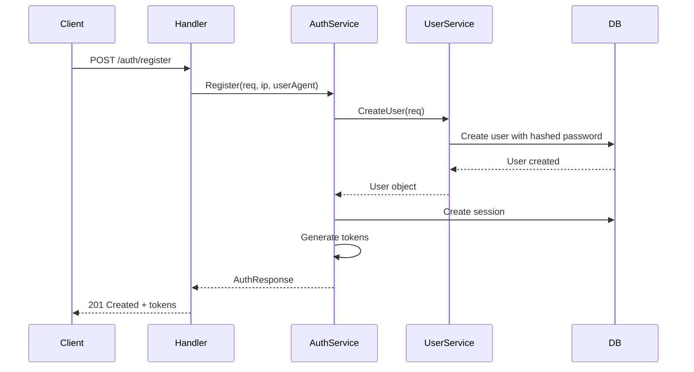
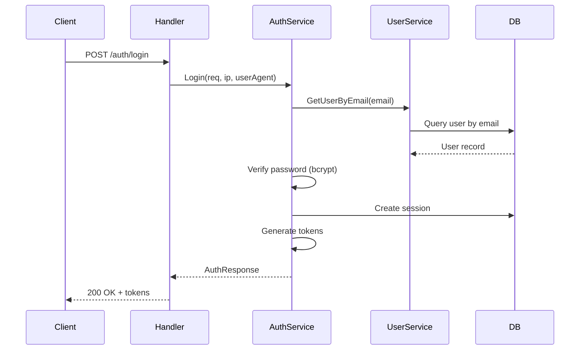
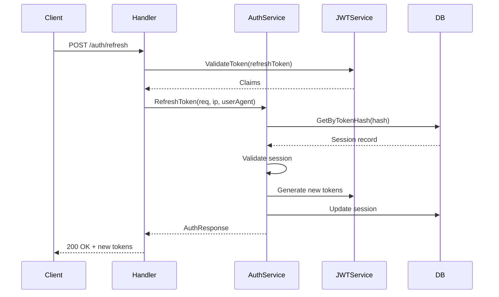
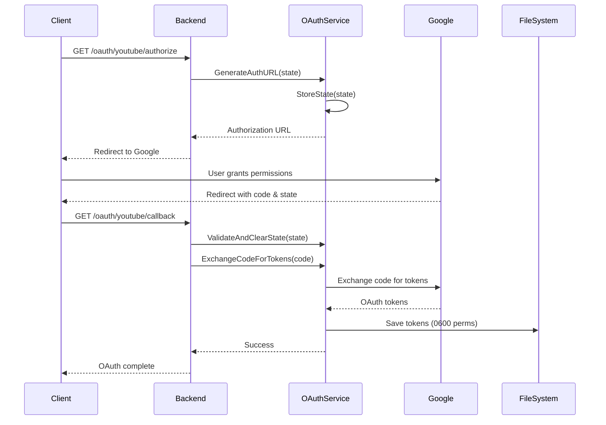
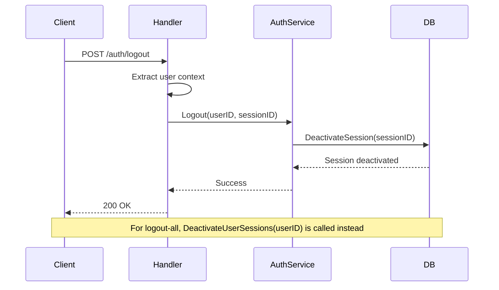

# Authentication System Architecture PRD

## Architecture Analysis

### Systems Designer Assessment

The authentication system demonstrates sophisticated multi-layered architecture with clear
separation of concerns across authentication domains:

- **JWT Authentication Layer**: Dual-token strategy with access/refresh token rotation
- **Session Management Layer**: Database-backed session tracking with device fingerprinting
- **OAuth Integration Layer**: YouTube API authentication with PKCE-like state validation
- **Authorization Layer**: Role-based access control with contextual permissions
- **Security Layer**: bcrypt hashing, CSRF protection, and comprehensive audit logging

The system implements industry-standard authentication patterns with enhanced security measures
including session fingerprinting, token rotation, and comprehensive audit trails.

### Technology Strategist Evaluation

**Strategic Technology Choices:**

- **JWT with HS256**: Appropriate for single-service architecture with shared secret
- **Dual-Token Strategy**: Access (15min) + Refresh (7 days) balances security and UX
- **Database Sessions**: Enables comprehensive session management and security auditing
- **OAuth 2.0**: Standard-compliant YouTube integration with proper state management
- **bcrypt**: Industry-standard password hashing with configurable cost factor

**Security Architecture Strengths:**

- Token rotation prevents replay attacks
- Session fingerprinting detects hijacking attempts
- Multiple logout strategies (single session vs all sessions)
- CSRF protection through OAuth state parameters

### Scalability Consultant Analysis

**Current Scalability Features:**

- Database session storage scales horizontally with read replicas
- JWT stateless validation reduces auth service load
- Session cleanup automation prevents data bloat
- OAuth token refresh automation reduces API friction

**Scale Considerations:**

- Session storage could migrate to Redis for performance
- JWT validation caching could reduce database calls
- OAuth state storage could move to distributed cache
- Rate limiting on authentication endpoints prevents abuse

### Risk Analyst Security Assessment

**Security Strengths:**

- Comprehensive session tracking with IP/User-Agent validation
- Automatic token rotation with secure hash storage
- Role-based access control with granular permissions
- OAuth state validation prevents CSRF attacks
- Secure token storage with file permissions and encryption

**Risk Mitigation Strategies:**

- Account lockout protection through rate limiting
- Session invalidation on security events
- Comprehensive audit logging for security monitoring
- Graceful degradation when external OAuth fails

## Technical Specifications

### Authentication Service Architecture

**Core Authentication Interface:**

```go
type ServiceInterface interface {
    Register(req *dto.RegisterRequest, ipAddress, userAgent string) (*dto.AuthResponse, error)
    Login(req *dto.LoginRequest, ipAddress, userAgent string) (*dto.AuthResponse, error)
    Logout(userID uint, sessionID uint) error
    LogoutAll(userID uint) error
    RefreshToken(req *dto.RefreshTokenRequest, ipAddress, userAgent string) (*dto.AuthResponse, error)
    ValidateSession(tokenHash string) (*models.Session, error)
    GetUserSessions(userID uint) ([]*dto.SessionResponse, error)
    RevokeSession(userID uint, sessionID uint) error
}
```

**Authentication Flow Components:**

1. **Registration Flow**: User creation with password hashing and session establishment
2. **Login Flow**: Credential validation with session creation and token generation
3. **Token Refresh Flow**: Access token renewal with refresh token rotation
4. **Logout Flow**: Session termination with token invalidation
5. **Session Management**: Multi-device session tracking and revocation

### JWT Token Management

**Token Structure and Claims:**

```go
type Claims struct {
    UserID    uint   `json:"user_id"`
    Email     string `json:"email"`
    Role      string `json:"role"`
    SessionID uint   `json:"session_id"`
    TokenType string `json:"token_type"`
    jwt.RegisteredClaims
}
```

**Dual-Token Strategy:**

- **Access Tokens**: 15-minute lifetime for API access
- **Refresh Tokens**: 7-day lifetime with rotation on use
- **Token Types**: Explicit differentiation prevents misuse
- **Session Binding**: Tokens linked to database sessions for revocation

**Token Security Features:**

- HS256 signing with configurable secret key
- Standard JWT claims (iss, sub, exp, iat, nbf)
- SHA256 token hashing for database storage
- Automatic expiration validation

### Session Management Architecture

**Session Model:**

```go
type Session struct {
    Auditable
    UserID    uint      `json:"user_id" gorm:"not null;index"`
    User      User      `json:"user" gorm:"foreignKey:UserID"`
    TokenHash string    `json:"-" gorm:"uniqueIndex;not null"`
    ExpiresAt time.Time `json:"expires_at" gorm:"not null"`
    IsActive  bool      `json:"is_active" gorm:"default:true"`
    IPAddress string    `json:"ip_address"`
    UserAgent string    `json:"user_agent"`
    LastUsed  time.Time `json:"last_used"`
}
```

**Session Security Features:**

- **Device Fingerprinting**: IP address and User-Agent tracking
- **Active Session Tracking**: Real-time session status management
- **Concurrent Session Support**: Multiple device authentication
- **Session Expiration**: Automatic cleanup of expired sessions
- **Last Activity Tracking**: Security monitoring and user insights

**Session Repository Operations:**

```go
type SessionRepositoryInterface interface {
    BaseRepositoryInterface[models.Session]
    GetByTokenHash(tokenHash string) (*models.Session, error)
    GetActiveSessionsByUserID(userID uint) ([]*models.Session, error)
    DeactivateSession(sessionID uint) error
    DeactivateUserSessions(userID uint) error
    CleanupExpiredSessions() error
    UpdateLastUsed(sessionID uint) error
}
```

### Authentication Middleware

**Authorization Pipeline:**

```go
type AuthMiddleware struct {
    jwtService  jwt.ServiceInterface
    authService auth.ServiceInterface
    logger      *logger.Logger
}
```

**Middleware Functions:**

1. **RequireAuth()**: Validates JWT tokens and sets user context
2. **RequireRole(roles...)**: Enforces role-based access control
3. **OptionalAuth()**: Validates tokens when present without requiring authentication
4. **ValidateRefreshToken()**: Specialized validation for token refresh endpoints

**User Context Management:**

```go
type UserContext struct {
    UserID    uint   `json:"user_id"`
    Email     string `json:"email"`
    Role      string `json:"role"`
    SessionID uint   `json:"session_id"`
}
```

**Context Operations:**

- **SetUserContext()**: Stores authenticated user data in request context
- **GetUserContext()**: Retrieves user data from request context
- **Role Validation**: IsAdmin(), IsModerator(), HasRole(), HasPermission()

### OAuth Integration Architecture

**YouTube OAuth Service:**

```go
type ServiceInterface interface {
    GenerateAuthURL(state string) string
    ExchangeCodeForTokens(ctx context.Context, code string) (*oauth2.Token, error)
    GetValidToken(ctx context.Context) (*oauth2.Token, error)
    RefreshToken(ctx context.Context, token *oauth2.Token) (*oauth2.Token, error)
    SaveToken(token *oauth2.Token) error
    LoadToken() (*oauth2.Token, error)
    IsAuthenticated() bool
    RevokeToken(ctx context.Context) error
    StoreState(state string)
    ValidateAndClearState(state string) bool
}
```

**OAuth Security Features:**

- **CSRF Protection**: State parameter validation with expiration
- **Token Persistence**: Secure file storage with restricted permissions (0600)
- **Automatic Refresh**: Token renewal 5 minutes before expiration
- **Scope Limitation**: YouTube force-ssl scope for transcript access
- **Token Revocation**: Proper cleanup through Google's revoke endpoint

**OAuth Flow Steps:**

1. **Authorization URL Generation**: Creates state-protected authorization URL
2. **Code Exchange**: Exchanges authorization code for access/refresh tokens
3. **Token Storage**: Persists tokens with secure file permissions
4. **Token Validation**: Checks expiration and triggers refresh when needed
5. **Token Revocation**: Invalidates tokens and cleans up storage

### API Endpoints

**Authentication Routes:**

```
POST /api/v1/auth/register        # User registration
POST /api/v1/auth/login           # User authentication
POST /api/v1/auth/refresh         # Token refresh
POST /api/v1/auth/logout          # Session logout
POST /api/v1/auth/logout-all      # All sessions logout
GET  /api/v1/auth/sessions        # List active sessions
DELETE /api/v1/auth/sessions/:id  # Revoke specific session
```

**OAuth Routes:**

```
GET  /api/v1/oauth/youtube/authorize  # Start OAuth flow
GET  /api/v1/oauth/youtube/callback   # Handle OAuth callback
GET  /api/v1/oauth/youtube/status     # Check auth status
POST /api/v1/oauth/youtube/revoke     # Revoke OAuth tokens
```

### Request/Response Models

**Registration Request:**

```json
{
  "first_name": "string (2-100 chars)",
  "last_name": "string (2-100 chars)",
  "email": "string (valid email)",
  "password": "string (8-72 chars)"
}
```

**Login Request:**

```json
{
  "email": "string (valid email)",
  "password": "string (min 6 chars)"
}
```

**Authentication Response:**

```json
{
  "user": {
    "id": "uint",
    "first_name": "string",
    "last_name": "string",
    "email": "string",
    "avatar": "string",
    "is_active": "boolean",
    "role": "string",
    "created_at": "timestamp",
    "updated_at": "timestamp"
  },
  "access_token": "string (JWT)",
  "refresh_token": "string (JWT)",
  "token_type": "Bearer",
  "expires_in": "number (seconds)"
}
```

**Session Response:**

```json
{
  "id": "uint",
  "ip_address": "string",
  "user_agent": "string",
  "last_used": "timestamp",
  "expires_at": "timestamp",
  "is_active": "boolean",
  "created_at": "timestamp"
}
```

## Authentication Flows

### Registration Flow

1. **Request Validation**: Validates email format, password strength, name requirements
2. **Duplicate Check**: Ensures email uniqueness in database
3. **Password Hashing**: Uses bcrypt with cost factor 12
4. **User Creation**: Creates user record with default role and active status
5. **Session Establishment**: Creates initial session with device fingerprinting
6. **Token Generation**: Issues access and refresh tokens linked to session
7. **Response**: Returns user data and authentication tokens



### Login Flow

1. **Credential Validation**: Verifies email exists and account is active
2. **Password Verification**: Uses bcrypt to compare password hashes
3. **Session Creation**: Establishes new session with device fingerprinting
4. **Token Generation**: Issues fresh access and refresh tokens
5. **Session Binding**: Links tokens to session via hash storage
6. **Response**: Returns user data and authentication tokens



### Token Refresh Flow

1. **Refresh Token Validation**: Verifies token signature and expiration
2. **Session Lookup**: Finds session by token hash
3. **Session Validation**: Checks session is active and not expired
4. **User Validation**: Ensures user account is still active
5. **Token Rotation**: Generates new access and refresh tokens
6. **Session Update**: Updates session with new token hash and metadata
7. **Response**: Returns new authentication tokens



### OAuth YouTube Flow

1. **Authorization URL**: Generates state-protected authorization URL
2. **User Authorization**: User grants permissions on Google's servers
3. **Callback Handling**: Receives authorization code and validates state
4. **Token Exchange**: Exchanges code for access and refresh tokens
5. **Token Storage**: Persists tokens with secure file permissions
6. **Integration**: Enables YouTube API access for transcript retrieval



### Logout Flows

**Single Session Logout:**

1. **Authentication**: Validates current session via access token
2. **Session Deactivation**: Marks specific session as inactive
3. **Response**: Confirms logout success

**All Sessions Logout:**

1. **Authentication**: Validates current session via access token
2. **Mass Deactivation**: Marks all user sessions as inactive
3. **Response**: Confirms logout from all devices



## Security Architecture

### Password Security

**Hashing Strategy:**

- **Algorithm**: bcrypt with configurable cost factor (default: 12)
- **Salt**: Automatic salt generation per password
- **Validation**: Timing-safe comparison to prevent timing attacks
- **Policy**: Minimum 8 characters, maximum 72 characters

**Security Controls:**

- Passwords never stored in plaintext
- Password fields excluded from JSON serialization
- Secure password validation with bcrypt.CompareHashAndPassword
- Password strength requirements enforced at validation layer

### Session Security

**Device Fingerprinting:**

- **IP Address Tracking**: Logs and monitors IP changes
- **User Agent Storage**: Tracks browser and device information
- **Session Binding**: Links tokens to specific sessions for revocation
- **Activity Monitoring**: Updates last used timestamp for security auditing

**Session Lifecycle Management:**

- **Creation**: New session per login with unique token hash
- **Validation**: Active status and expiration checks
- **Revocation**: Individual or mass session termination
- **Cleanup**: Automatic removal of expired sessions

### Token Security

**JWT Security Features:**

- **HS256 Signing**: HMAC with SHA-256 for token integrity
- **Configurable Secret**: Environment-based secret key management
- **Standard Claims**: Issuer, subject, expiration, not-before validation
- **Custom Claims**: User ID, email, role, session ID for authorization

**Token Lifecycle:**

- **Short-lived Access**: 15-minute lifetime minimizes exposure window
- **Long-lived Refresh**: 7-day lifetime balances security and UX
- **Token Rotation**: New refresh token issued on each use
- **Hash Storage**: SHA256 hash stored instead of token for database security

### OAuth Security

**CSRF Protection:**

- **State Parameter**: Random 32-byte base64-encoded state
- **State Storage**: In-memory storage with 10-minute expiration
- **State Validation**: One-time use with automatic cleanup
- **Thread Safety**: Mutex-protected state operations

**Token Storage Security:**

- **File Permissions**: 0600 (owner read/write only)
- **Directory Creation**: 0700 permissions for token directory
- **Automatic Refresh**: 5-minute buffer before expiration
- **Secure Cleanup**: Proper token revocation and file removal

### Authorization Framework

**Role-Based Access Control:**

```go
// User roles
const (
    RoleUser      = "user"
    RoleAdmin     = "admin"
    RoleModerator = "moderator"
)

// Permission checks
func (uc *UserContext) IsAdmin() bool
func (uc *UserContext) IsModerator() bool
func (uc *UserContext) HasRole(roles ...string) bool
func (uc *UserContext) HasPermission() bool
```

**Middleware Authorization:**

- **RequireAuth**: Validates authentication for protected endpoints
- **RequireRole**: Enforces specific role requirements
- **OptionalAuth**: Handles mixed public/private endpoints
- **Context Setting**: Automatic user context population

### Audit and Monitoring

**Security Logging:**

- **Authentication Events**: Login, logout, registration logging
- **Session Events**: Creation, validation, revocation logging
- **OAuth Events**: Authorization, token refresh, revocation logging
- **Error Events**: Failed authentication attempts and security violations

**Monitoring Points:**

- **Failed Login Attempts**: Rate limiting and account protection
- **Session Anomalies**: IP changes, concurrent sessions, unusual activity
- **Token Refresh Patterns**: Automated monitoring for abuse
- **OAuth Failures**: Failed authorization flows and token issues

## Performance Considerations

### Database Performance

**Session Query Optimization:**

- **Indexed Fields**: user_id, token_hash, is_active for fast lookups
- **Compound Indexes**: user_id + is_active for active session queries
- **Pagination Support**: Efficient session listing with limits
- **Cleanup Automation**: Scheduled removal of expired sessions

**Connection Management:**

- **Connection Pooling**: 25 max open, 5 idle connections
- **Transaction Efficiency**: Minimal transaction scope for session operations
- **Read Optimization**: Session validation queries optimized for speed

### Token Performance

**JWT Processing:**

- **Minimal Claims**: Essential data only to reduce token size
- **Fast Validation**: HS256 for symmetric key performance
- **Memory Efficiency**: Claims parsing without unnecessary allocations
- **Caching Opportunities**: Secret key caching for validation performance

### OAuth Performance

**Token Management:**

- **Preemptive Refresh**: 5-minute buffer prevents API failures
- **File System Cache**: Local token storage for performance
- **State Cleanup**: Automatic expired state removal
- **HTTP Timeouts**: 10-second timeout for revocation requests

## Scalability Architecture

### Horizontal Scaling

**Session Storage Scaling:**

- **Database Scaling**: Read replicas for session validation queries
- **Cache Integration**: Redis caching for frequently accessed sessions
- **Partitioning**: User ID-based session table partitioning
- **Cleanup Distribution**: Scheduled cleanup across multiple instances

**JWT Scaling:**

- **Stateless Validation**: No database calls for access token validation
- **Secret Distribution**: Shared secret across application instances
- **Load Balancing**: Stateless design enables horizontal scaling
- **Token Rotation**: Distributed refresh token handling

### Performance Optimization

**Caching Strategies:**

- **Session Caching**: Redis cache for active session validation
- **User Context Caching**: Temporary user data caching
- **OAuth Token Caching**: In-memory OAuth token caching
- **Role Caching**: User role and permission caching

**Database Optimization:**

- **Index Strategy**: Optimized indexes for authentication queries
- **Query Optimization**: Efficient session and user lookup queries
- **Connection Pooling**: Optimal database connection management
- **Read Replicas**: Separate read/write workloads

## Implementation Roadmap

### Phase 1: Core Authentication (Completed)

- ✅ JWT dual-token implementation
- ✅ Session management with device fingerprinting
- ✅ Password hashing with bcrypt
- ✅ Basic role-based authorization
- ✅ Authentication middleware pipeline

### Phase 2: Enhanced Security (Completed)

- ✅ OAuth YouTube integration
- ✅ CSRF protection with state validation
- ✅ Comprehensive session management
- ✅ Token rotation and refresh flows
- ✅ Audit logging and monitoring

## Security Compliance

### Security Standards

**Authentication Standards:**

- **OWASP Guidelines**: Follows authentication security best practices
- **JWT Standards**: RFC 7519 compliant implementation
- **OAuth 2.0**: RFC 6749 compliant Google integration
- **Password Security**: NIST password guidelines compliance

**Data Protection:**

- **Encryption**: Secure token storage and transmission
- **Access Control**: Principle of least privilege
- **Audit Trail**: Comprehensive security event logging
- **Data Minimization**: Minimal claims in tokens

### Compliance Considerations

**GDPR Compliance:**

- **Data Processing**: Clear lawful basis for authentication data
- **Data Retention**: Session cleanup and token expiration
- **Right to Erasure**: Account deletion with session cleanup
- **Data Portability**: User data export capabilities

**Security Monitoring:**

- **Threat Detection**: Anomalous authentication pattern detection
- **Incident Response**: Security event logging and alerting
- **Regular Audits**: Authentication system security reviews
- **Penetration Testing**: Regular security assessment planning

## Conclusion

The English Learning Assistant authentication system demonstrates comprehensive security
architecture with modern authentication patterns. The dual-token JWT strategy combined with
database-backed session management provides excellent balance between security and user experience.

Key architectural strengths include:

- **Security-First Design**: bcrypt hashing, token rotation, session fingerprinting
- **Scalable Architecture**: Stateless JWT with database session management
- **Comprehensive Authorization**: Role-based access control with contextual permissions
- **OAuth Integration**: Secure YouTube API integration with CSRF protection
- **Operational Excellence**: Audit logging, session management, and cleanup automation

The system is well-positioned for future enhancements including multi-factor authentication,
advanced threat detection, and enterprise SSO integration while maintaining strong security
foundations and operational reliability.
